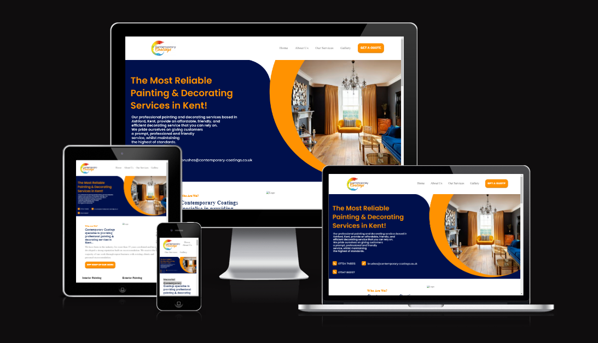

## Contemporary Coatings - A Decorators' Website
[View Live Project Here](https://burakkuboido.github.io/Contemporary_Coatings_01/)

This websites' sole purpose is for my own gain, to see what I am capable of when it comes to creating a professional standard website with minimal interactivity. By creating a decorators website, I was able to include a contact form, a google maps API to find the location of the decorators as well as an interactive gallery. I believe when creating professional websites, these sort of features are usually if not always suggested when designing the overall idea of a website. So, by working on these features, it will further increase my knowledge and skills when it comes to designing and developing websites.

## User Experience (UX)

- ### User Stories

    - #### First Time Visiting Goals

        As a first time visitor, I want to understand multiple aspects of the website. 

        What's the purpose.
        How easilly can I navigate.
        How I can contact the decorator and their services.
        Is all the information I need on that website.

    - #### Returning Vistior Goals
        As a returning visitor, I want to see what projects they have previously worked on and if they meet my needs.

    - #### Frequent Visitor Goals
        In terms of frequent visitor goals, I want to be able to keep up to date on their projects and see what their services include.

- ### Design

    - #### Colour Scheme

        When working on the design aspect of my website, I wanted to create a website that showed all the information that the user needed on one page. This would make it so that the user wouldn't have to move from page to page to find different sources of information. Keeping it as simple as possible for the user. I wanted to give the site a splash of colour to symbolise the colours of which a decorator would use in their projects. Keeping it light but also adding a few darker colours to add to the contrast. Making dark colours stand out from the light backgrounds and vice versa.

        I decided to keep the simple design aspect into the typography, making it use the basic typography that browsers use.

        In terms of colours, I needed to make sure buttons and links stood out from amongst the rest of the contents, to make the user feel the need to "click me". Making these stand out was vital as I needed to make sure the user knew where they needed to go on the page to get to their desired information content.

    - #### Typography

        Using the standard font that each browser used was an idea I wanted to play with, to see if each browser used different standard fonts and if they played well for my site. Through research and trial and error, I decided that keeping the site's typography simple was a good idea to stick with as not only did this mean less strain on the readers eyes, but less work needed for responsive design as some typography made it hard to read on certain aspects of the site.

    - #### Imagery

        The hero image that's placed on the site was used to tell the user exactly what they wanted to hear straight from the get-go. Including where they are based, what they are, what they do, their contact information as well as an image to backup the type of projects they have previously worked on.

        The images that I have used on my site were images of other decorators website that they in turn have used in their galleries. Though, if you were to see for yourself, my gallery does not showcase these said images. For an unknown reason as of this moment, these images do NOT show. Though, when porting my site onto the basic port oin GitHub, these images show. Though, the JavaScript works as you can click on a button and it would change what alt text would show in place of each image. So in some sense, this does still work, just not to it's ideal state. Showcasing these images were a vitgal part of the website as users would need to see what work they have previously worked on so that the user could trust the decorator's skills and experience.

        I wanted to add a modal for each image so that when the user clicked or tapped on an image, it would make it bigger for viewing, but as time was short and I have worked on this project for multiple weeks now, it grew tiring and I know I needed to submit it as it was getting late.

    - #### Wireframes

        I regret to say that I have no wireframes. I was short on time due to multiple aspects of my life getting in the way of working on my project, so I decided to skip the wireframe part and made sure my website was complete. This took a toll on the overall design of my website as it took longer to implement the features I wanted, additionally it took extra time to figure out where to place the containers on the website. It's a no-brainer to say that wireframes are vital when developing a website.

## Features

-   Responsive on all device sizes:
    - Mobile: [Mobile_Version](assets/images/Mobile.png)
    - Tablet: [Tablet_Version](assets/images/Tablet.png)
    - Desktop: [Desktop_Version](assets/images/Desktop.png)

-   Interactive Elements:

    - **Nav Bar:**
    At the top of the website, there is a navigation bar which can be seen. If the user scrolls down slightly, the navigation bar hides itself to increase viewability on the overall website. This stops the bar from getting in the way when it scrolls down as the user scrolls the page. This was to overcome the problem which was making the navigation bar sticky. When the user scrolls, the navigation bar would get in the way majority of the time, to stop this, I made the opacity of the navigation bar to 0.1 when the user scrolls. However, whenever the user hovers their cursor over the navigation bar, the navigation bar would then set it's opacity to 1.0 so the navigation bar could be seen. The point of adding these features in was so that the user could easilly click on one of the links in the navigation bar to take them to the specific element of the page so that they can easilly navigate to whichever part they desired. Couldn't have the user scroll all the way back to the top just to get to a different part of the page. It needed accessibility.

        [The Navigation Bar](assets/images/Nav_Rec.webm)

    - **Links To Other Sections of The Page Via Text:**
    As you can see from the below recording, I have made it so that there are links that go to other parts of the page for the users' convenience.

        [Links To Other Parts Via Text](assets/images/Links_Rec.webm)

    - **Gallery:**
    The gallery was another vital part of the website as the user would need to be able to use the decorator's projects as a reference as to what services they would like. In addition to this, it would be beneficial to the user and the decorator if they were able to see the decorator's skills and knowledge when it comes to this topic. I made it so that the user could easilly click on a button to filter the images to find what images they would like to see. This made accessability of the website a lot better and going through the extra effort of making it convenient for the user to find what they would like to discover.
    I wanted to add a modal to this gallery so that the user could click on an image and it would enlarge it on their device but decided against it as I was running out of time.

        [Gallery](assets/images/Gallery_Rec.webm)

    - **Google Maps API:**
    I wanted to add a google maps API to the website to add a little more interactivity for the user. In addition to this, the user would be able to find out where their company is located and if they deem it too far away for the decorator's to come to their location for the desired project.

        [Google Maps API](assets/images/API_Rec.webm)

    - **Form:**
    The form part of my website was crucial as I needed a way for users to be able to reach out to the decorator via email. Without this, it would almost render my website futile. Luckily if the form fails, the user has the decorator's contact details to be able to reach them. It was created with the idea of the users,to be able to reach out to the decorator if they are interested in their skills and experience as a decorator.

        [Form](assets/images/Form.png)

## Technologies Used

### Languages Used

-   [HTML5](https://en.wikipedia.org/wiki/HTML5)
-   [CSS3](https://en.wikipedia.org/wiki/Cascading_Style_Sheets)
-   [JavaScript](https://en.wikipedia.org/wiki/JavaScript)

### Frameworks, Libraries and Programs Used

-   [Font-Awesome](https://fontawesome.com/)
        Was used to add the down arrow into my Work page.
-   [Git](https://git-scm.com/)
        Was used for version control via github. To be able to tell where I have included what and when. This helps to unerstand where problems started to occur.
-   [GitHub](https://github.com/)
        Was used to store the projects code after being pushed to Git.
-   [Screen Recorder](https://scre.io/)
        Was used to record features of my website for the README file.
-   [Google Maps API](https://developers.google.com/maps)
        Was used to implement the Google Maps API feature onto my website.
-   [EmailJS](https://www.emailjs.com/)
        Was used to make the form within the website work.

## Testing

Due to timing, the W3C Markup Validator and W3C CSS Validator Services were not used to validate the website's code. Testing is a vital part of the design and development stage of web development. In the future, I plan to make more time for these.

### Testing User Stories from User Experience (UX) Section

- #### First Time Visiting Goals

        What's the purpose.
        How easilly can I navigate.
        How I can contact the decorator and their services.
        Is all the information I need on that website.

    1. What's the purpose?
        - "It seems that Bens' website is a decorators' website that showcases their skills and experience in decorating. it also allows for the user to submit a form to contact the decorator."

    2. How easilly can I navigate?
        - "All the links work to my knowledge, I was using a phone and it worked, I then moved onto the PC and it worked. Though, on mobile it seems taht the links at the top of the page are a bit over the place."

    3. How I can contact the developer of the website?
        - "There is a form in which I can use, it sent me an email on submission, so it seems to work great for the time being. There is also contact information across different parts of the website."

    4. Is all the information I need on that website?
        - "Contact information, what their services are and what they do seem to be easily found on the website."

- #### Returning Vistior Goals

    1. As a returning visitor, I want to see what projects they have previously worked on and if they meet my needs?
        - "If I was looking for a decorator, I wouldnt be returning as usually I would want one job done and that is all. Though, I can see what projects they have previously worked on and based of my hypothetical needs, they meet it."

- #### Frequent Visitor Goals

    1. In terms of frequent visitor goals, I want to be able to keep up to date on their projects and see what their services include?
        - "I can't exactly tell what is up to date and what isn't. Though, Services can be easilly found across the website."

### Further Testing
- The website was manually tested on a Samsung S8+, Iphone 5/SE, Ipad Air, PC and some random device dimensions.
- The website was manually tested on Google Chrome and FireFox.
- The website was viewed in Developer tools at all settings of responsiveness. 
- All links clicked and checked.
- Sent the website to a friend to check to see if everything works well on his end.

### Known Bugs (Resolved)
    1. Gallery margin on the left was twice the size of the right when clicking on the buttons.
    2. Form would not work when submitting. Once it did work, it wasnt sending the right information over.
    3. Hero image would be stretched or not fitting 100% of the screen width.
    4. Navigation bar wouldnt stick.
    5. Navigation bar wouldn't be visible when scrolling back to the top.
    6. Google Maps API would be all over the place or dissapear entirely at certain screen widths.
    7. All images on the page would not show on the hosted platform. It has now been fixed through talking with tutor support on Code Institute. The reason it wasn't working was due to the file locations starting with "/" for example, "/assets/images...". Remove the / and it worked.

### Known Bugs (Not Resolved)
    1. Nav Bar sometimes doesnt turn visible when the requirements are met.
    2. Website does NOT work on samsung fold phones due to their phones' width being incredibly small.

## Credits

### Code
- [Stackoverflow](https://stackoverflow.com/) To remind me what I might be missing in my code for it to not work properly.
- [EmailJS](https://www.emailjs.com/) To help me understand how the peice of software works.
- [Google Maps API](https://developers.google.com/maps) To help me figure out what it is I need to implement in my own code for it to work.

### Content
- [Code Institute Sample Readme](https://learn.codeinstitute.net/courses/course-v1:CodeInstitute+CSSE_PAGPPF+2021_Q2/courseware/66cf361c769a41d496f5001fae6f9be7/3b5cd5dc8313462aa5975a3c9b9a1a3c/) for Readme layout.

### Media
- Images from the Gallery can be found [here](https://www.kent-decorators.co.uk/)
- Image for Banner/Hero Image cannot be found. It was created using a peice of online software. Gives an example in PSD form and you can edit it to your liking.
